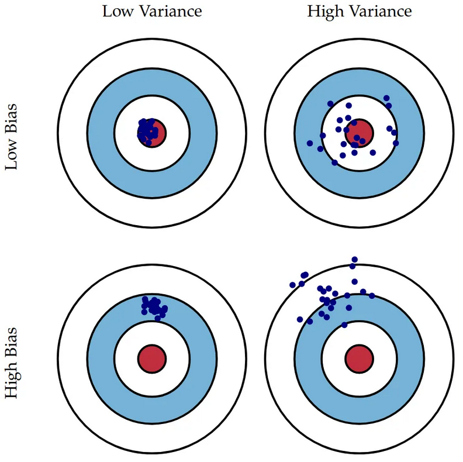

This repository is note from watching video [Google Cloud Machine Learning Engineer Certification Prep](https://www.udemy.com/course/google-cloud-machine-learning-engineer-certification-prep/).

Building models in google cloud:
+ Cloud AutoML
+ AI platform training
+ Kubeflow
+ Dataproc and Spar kML
+ BigQuery ML

To deploying ML model, we need:
+ ML services
+ Containers
+ Orchestration

Step to production:
+ Wrap our model in a service > endpoint as output
+ Containerization
+ Deploy and orchestration > google cloud provides Cloud Run and Kubernetes Engine for running containers. Cloud Run good for small number of containers.

Comprehensive ML platforms: Kubeflow and VertexAI.

**Service in VertexAI**:
+ Datasets
+ Feature store
+ Workbences > manage notebook and user manage notebook. In user manage notebook, we can setting the environment.
+ Training > we can use AutoML or custom training. Custom training usually use for models at scale.
+ Cloud storage > really well-suited for unstructured data (image, video, text). We can also used in applications, for example in microservices architecture for temporary storage between services. 
+ BigQuery: serverless data warehouse, petabyte scale, uses SQL but is not a relational database, analytical database.
    + Datasets ㅡ collection of tables and views.
    + Tables ㅡ supports scalar and nested structures, stored in columnar format, and partitioning.
    + Views ㅡ projection of one or more tables, tables can be joined, and views can be materialized.  

    **Partitioned tables**: table divided into segments (partitions). It will improves query performance, and lowers cost.

    **Cluestered tables**: is another optimization we can use with BigQuery. It is data sorted based on values in one or more columns. It can improve performance of aggregate of aggregate queries. It also can reduce scanning when cluster columns used in WHERE clause.

+ Dataflow and Dataproc: is designed for batch processing of large datasets. 
    + **Dataflow** > horizontally scalable, managed service, and supports windowing operations. Windowing operations especially important when we working with streaming data and time series data. 
    + **Dataproc** > managed Spark and Hadoop service. Dataproc often used for ETL and ELT. When we use Dataproc, we often create ephemeral clusters. Epheremal clusters means we start cluster when we need we run a job and then we shutdown the cluster.

**Virtual machines**:
+ Compute engine > we can configure virtual machine.
+ Managed instance groups allow us to work with multiple identical virtual machines.
+ Containers > Cloud Run and Kubernetes Engine.
    + **Cloud Run**: 
        + We can run containers in two modes, service and batch. Service mode for a machine learning algorithn that provides predictions. A containers always available, waiting us to call the API. Meanwhile, batch mode useful for thins like ETL.
        + Use for mircoservices and endpoints.
        + Use when minimizing administration is a priority.
    + **Kubernetes Engine**:
        + Large scale container deployments.
        + We have control over cluster.        

GPUs and TPUs: GPUs is for higher precision than TPUs.

**File format for training data**:
+ Columnar file formats: 
    + Data stored in column orientation.
    + Allows for highly effective compression.
    + Examples: parquet, orc, and petastorm (petastorm supports multi-dimensional data).
+ Tabular text file formats:
    + Comma separated values (CSV).
    + Widely used, easy to view and debug.
    + No support for data types.
    + Inefficient at large scales.
+ Nested file formats:
    + Stores instances in hierarchical format.
    + Records have one parent, zero or more children.
    + Plain text: json and xml.
    + Binary: protocol buffers and avro.
    + TFRecords used in TensorFlow, based on protobuf.
+ Array-based file formats:
    + Supports vectorization.
    + NumPy is a binary format. 
+ Hierarchical file formats:
    + Supports heterogeneous, complex datasets.
    + Examples: HDF5 and NetCDF.
    + HDF used when data does not map to columnar formats well, for example medical data.
    + NetCDF popular in climate science and astronomy.

**Risks to successful ML model development**:
+ Data risks: 
    + Insufficient data
    + Data quality issues
    + Biased data: missing data, inconsistent labeling
    + Data poisoning (security risk)
+ Process risks:
    + Poor problem-model fit
    + Insufficiently agreed upon objectives
    + Unrealistic expectations
    + Insufficient funding
    + Data privacy and confidentiality

**Feature attributions**: indicates how much a feature contributes to a prediction. Features have attribution scores that shows how much feature affected the change in prediction value. 
+ Use Approximate Nearest Neighbor Service:
    + Mislabeled examples > look for examples in the training data where similar examples have a different label.
    + Active learning > look for unlabeled examples where neighbors have a variety of labels. Label these and add them to the training data.
    + Misclassification analysis > look at examples from the training set that are 'nearby' the misclassified instance to identify if new data is needed or existing examples are mislabeled/noisy.
    + Decision support > provide a rationale for an ML-generated prediction/decision by surfacing previous relevant predictions or similar data points. 

**Transfer learning**:
+ Inductive transfer learning: 
    + Same source and target domains, different tasks.
    + Use knowledge from prior task and apply to new task.
    + Trained model has knowledge of domain.
+ Transductive transfer learning:
    + Same source and target not the same domains but interrelated.
    + Derive similarities between source and target.
    + Source domain has labelled examples, target domain does not.
+ Unsupervised transfer learning:
    + Similar to inductive transfer learning but both source and taget domains have unlabeled datasets.

Troubleshooting models:
+ Underfitting:
    + Model performs poorly on training and validation data. 
    + To correct undefitting: increasing the complexity of the model, increase training time and epochs.
+ Overfitting:
    + Model performs well on training data and pooly on validation data,
    + To correct overfitting: regularization which limits information captured.
+ Bias and variance:
    + Bias error is result of missing relationship between features and labels.
    + Didn't sufficiently generalize from training data.
    + Variance error is due to sensitivity in small fluctuations in the training data.
    + Variance is the difference among a set of predictions.

     

    Note: blue points is the predictions. [[source image](https://towardsdatascience.com/bias-and-variance-in-linear-models-e772546e0c30)]

**Training machine learning**: 
+ Hyperparameter tuning: please remember that hyperparameters are not learned! "Tune" means finding which combinations are the best. Methods that we can use include Grid Search, Random Search, and Bayesian Search. Bayesian Search is sequential model-based optimization. It use previous iteration to improve current iteration.
+ Unit tests: tests that run automatically in the CI/CD pipeline to prevent deploying an broken model. For example, feature engineering functionality, encoding inputs, custom modules, and output types.
+ **Distributed training**: training a model across multiple nodes in a cluster.
    + Available in VertexAI
    + Need to use a framework that supports distributed training, like TensorFlow.
    + Role of nodes in distributed training:
        + Primary replica > to manage other nodes.
        + Workers > to do a portion of the training work.
        + Parameter services > to store model parameters and coodinate shared model state across workers.
        + Evaluators > to evaluate models.

    Reduce training time with reduction server allow us to communicating gradients (when training model) between nodes. Reduction server requires use of GPUs. 

**Model evaluation**: 
+ Accuracy > the number of correctly predicted data points.
+ Precision > a measure of how many of the positive predictions made are correct (true positives).
+ Recall > a measure of how many of the positive cases the classifier correctly predicted, over all the positive cases in the data.
+ F1 Score > a harmonic mean pf precision and recall.
+ ROC curve plots the true positive rate (TPR) against the false positive rate (FPR) at various classification thresholds.

**Serving options**: we can use pre-built containers like TensorFlow, TensorFlow Optimized Runtime, Scikit-learn, and XGBoost. We can optionally configure those machines including use GPUs, number of Virtual CPUs per node, and memory per node. We also can use custom containers. The requirements for a custom container with VertexAI:
+ Provide a docker container image running HTTP server.
+ Responds to health checks, liveness checks, and predicition requests.
+ Each request and response must be 1.5MB or smaller.
+ Vertex Service AI Agent is Google managed service account, has sufficient permissions to work with custom containers.

Other example of pre-build containers:
+ NVIDIA Triton is an open source inference serving platform optimized for CPUs and GPUs. VertexAI Prediction runs in custom container published by NVIDIA. These supports TensorFlow, PyTorch, TensorRT, Scikit-learn, and XGBoost. 
+ Optimized TensorFlow Runtime allow us to run TensorFlow models at lower cost and latecy than open source pre-built TensorFlow containers.

**Prediction services**: VertexAI allocates nodes for online and batch predictions. Online prediction (synch) have endpoint, and batch prediction (asynch) run as jobs.

**Monitoring**: VertexAI model monitors predicition input data fro skew and drift. **Skew** ㅡ feature data distribution in production deviates from training. **Drift** ㅡ feature data distribution in production changes significantly over time. Scope of monitoring: supports skew and drift detection for categorical and numerical features. Skew based on training data, meanwhile drfit based on recent past production data. When distance score between distributions exceed specified thresold identify as skew or drift. 

Some guidelines to make sure that we detect bias data distribution:
+ Detect biased data distribution, not representative of the population.
+ Biased data representation, such as negative reviews being more frewuent in one gender than another.
+ Proxy variables, for example home location correlating with income.

Troubleshooting models:
+ Model performs poorly on training and validation data.
+ Correct for underfitting: increasing the complexity of the model, increase training time

**ML security**:
+ Data security:
    + Encryption.
    + Role based access controls.
    + Data lifecycle management.
+ Model training security:
    + Role based access controls to models and pipelines.
    + Audit logs.
+ Sensitive data:
    + Data that requires additional security measures: encryption and restricted access controls.
    + Challenges:
        + Role based security oriented toward ownership.
        + ML engineers need view access to entire datasets.
        + Reducing resolution of data may be insufficient.
        + Removing sensitive data can degrade model performance. 
+ Identifying sensitive data:
    + Data in structured databases and datasets: goverment IDs and credit card numbers.
    + Data in unstructured data: notes in electronic patient records and faces in images.
    + Data in combination of fields: multiple reduced resolution fields, and frequency analysis.
+ Protecting sensitive data:
    + Remove
    + Masking: substitution cipher, tokenization, PCA.
    + Coarsening: locations, postal codes, numeric quantities, IP addresses.

**Optimizing pipeline**: 
+ Data processing:
    + If our data already in BigQuery and we use TensorFlow, we can use the BigQueryClient to access the data.
    + Keep in mind with BigQuery, our costs are in part based on how much data you scan. So use partition tables so we can minimize the amount of data scanned. 
    + If we have some tolerance on time, and we don't need like super low latency for processing the data, we can use Dataflow FlexRS (flexible resource) scheduling.
    + Dataflow Shuffle is an operation where we have to move data between nodes or servers.
    + If we use Tensorflow, and we pre-processing data, we can save the pre-processing result data as TFRecord.
+ Model training:
    + Distributed training is really useful when we build really large model, but before we depend on distributed training, consider scalling up the size of our machine. 
    + If we use TensorFlow, be sure to use MultiWorkMirroredStrategy in TF distributed training that optimizes data sharing among the different nodes.
    + Use tf.data API to maximize efficiency of data pipelines using GPUs and TPUs. 
    + Stream data from cloud storage for Scikit-learn models instead if copying data to servers.
    + Use early stopping.
    + Use automatic hyperparameter tuning.
+ Model serving:
    + Use reduced-precision floating types, like use 16-bit instead of 32-bit. Use mixed-precision during training for numeric stability.
    + Use post-training quantization, like reduces model size.
    + Use TensorFlow Model Optimization Toolkit, if we use TensorFlow.
    + If we use NVIDIA GPUs, consider to use TensorFlow with TensorRT which is TensorFlow module that performs optimizations.
    + Use base64 encoding when sending images.
    + Use batch predictions for large datasets.
    + Run services in same region to reduce ingress/egress charges. 

### Basic Data Exploration

Descriptive statistics: summarize information about distribution of values, central tendency, and spread of values.

Encoding data: useful for categorical data, have several types including one-hot encoding ([1, 0, 0], [0, 1, 0], [0, 0, 1]), ordinal encoding ([1, 2, 3]), binary encoding (for example binary 2 > [0, 0], [1, 0], [0, 1]), and feature hashing (convert to vector).

Feature selection: reduce the number of features to improve performance. 
+ Numeric input - numeric output:
    + Pearson's Correlation: linear relationship, ratio between covariance of two variables and product of standard deviation.
    + Spearman's Rank Coefficient: non-linear relationship, based on rank value of two variables, high when variables have similar ranks.
+ Numeric input - categorical output (and vice versa):
    + ANOVA: linear relationship, difference among means.
    + Kendall's Rank Coefficient: non-linear relationship, ordinal association, rank correlation.
+ Categorical input - categorical output: 
    + Chi-Squared test: measure likelihood observed difference happened by chance.
    + Mutual information: measure of dependence between variables.

Imbalanced datasets: 
+ Occurs when distribution of instances in a training set is skewed.
+ Too few examples of some class: majority class (more frequent class) and minority class (less frequent class).
+ Minority class often more important.

Causes of imbalance:
+ Naturally
+ Biased sampling
+ Measurement errors

Mitigating impact of imbalance data:
+ Collect more data.
+ Generate synthetic data (SMOTE).
+ Resampling.
+ Use decision tree algorithms.

Feature crosses: is a type of synthetic features. 
+ Multiply (cross) two or more features to form a new feature. 
+ Usd to improve predictive capabilities of a model.
+ Especially useful with non-neural network algorithms.

Handling missing data:
+ Delete rows with missing data: completely remove rows with missing data from the datasets.
    + Advantages: removes instances that do not provide additional information.
    + Disadvantages: loss of information related to other features, not practical when significant portion of datasets has missing values for some features.
+ Replace with central tendency value: use mean, median or mode for missing numeric values.
    + Advantages: works well with small datasets.
    + Disadvantages: can increase variance and bias in dataset, can cause data leakage (e.g. time series).
+ Assign a unique category: provides a single new category NA or missing.
    + Advantages: reduces the chance of increasing variance because adding only one category.
    + Disadvantages: add another feature value to a categorical value.
+ Predict missing value: use machine learning to predict it, like regressions for numeric value, and decision tree for categorical value.
    + Advantages: unbiased relative to the rest of dataset.
    + Disadvantages: cost and time of running predicitions.
+ Last observed value carried forward: use last known value. Useful for time series. 
    + Variations: moving average and linear interpolation.

Handling outliers: instances that are significantly different from ither instances. Caused by data entry errors, measurement errors, data processing errors, sampling errors, and naturally.

Problems with outliers:
+ Increases variance.
+ Violate assumptionsof some statistical tests such regression and ANOVA.
+ Exception: outliers may be anomalies we want to detect.

Data leakage: training data contains additional information that was unintended and not available during prediciton.

Two types of data leakage:
+ Data leakage in training: like performing normalization, standardization using full datasets instead of training set only.
+ Data leakage in features: proxy variables not removed.

Ways to engineer features:
+ Transform existing feature: like map numberic variable to a scale of 0 to 1.
+ Bucketing: like creating subgroups of feature values.
+ Feature cross:
    + Cartesian product of two or more features.
    + Helps with non-linear relationships.
+ Binary features
+ Decompose values to parts
+ One-hot encoding
+ Normalization: convert numeric values to a standard. Tipically 0 to 1. 

### Note exercise
+ Diagflow > is a natural language understanding platform that makes it easy to design and integrate a conversational user interface into your mobile app, web application, device, bot, interactive voice response system, and so on. Using Dialogflow, you can provide new and engaging ways for users to interact with your product. Dialogflow can analyze multiple types of input from your customers, including text or audio inputs (like from a phone or voice recording). It can also respond to your customers in a couple of ways, either through text or with synthetic speech.

+ AutoML Tables: uses structured data to build models with little input from users.

+ There is no Bigtable ML but BigQuery ML is a managed service for building machine learning models in BigQuery using SQL.

+ Managed datasets in VertexAI provided which of the following benefits: in a central location, create labels, and annotations only. 